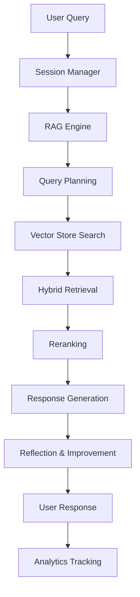

# 🤖 Contextual RAG Chatbot - Intelligent Document Assistant

A state-of-the-art **Retrieval-Augmented Generation (RAG)** chatbot built with Google Gemini AI, featuring advanced document processing, contextual conversation management, comprehensive analytics, and a modern, responsive UI. This enterprise-grade solution provides intelligent document-based question answering with thinking and reflection capabilities.


## ✨ Features

### Core Capabilities
- **🧠 Advanced AI Integration**: Powered by Google Gemini 1.5 with adaptive thinking and reflection
- **📚 Multi-Format Document Processing**: Accurate PDF processing with OCR fallback support
- **🔍 Hybrid Search**: Combines semantic (dense) and keyword (sparse) retrieval methods
- **💬 Contextual Conversations**: Adjustable context window (1-20 messages) for maintaining conversation flow
- **📊 Comprehensive Analytics**: Real-time metrics, interactive visualizations, and Excel export
- **🎨 Modern UI/UX**: Responsive design with multiple themes and accessibility features
- **🔒 Enterprise Security**: Privacy mode, API key rotation, and input validation
- **⚡ High Performance**: Async processing, intelligent caching, and circuit breakers

### Key Features by Category

#### Document Processing
- Accurate page counting from PDF metadata
- Multiple extraction methods (PyPDF2, pdfplumber, OCR)
- Semantic chunking with overlap
- Table extraction and formatting
- Header preservation for context
- Batch processing support

#### Conversation Management
- Session isolation and persistence
- Adjustable context window
- Conversation history export (JSON)
- Search within conversations
- Privacy mode for sensitive data
- Multi-session support

#### Analytics & Reporting
- Real-time performance metrics
- Interactive Plotly dashboards
- AI-generated insights and recommendations
- Excel export with multiple sheets
- HTML report generation
- Predictive analytics

#### User Interface
- 5-page application structure
- 4 theme options (Modern, Dark, Light, Classic)
- Responsive design for all devices
- Accessibility features (WCAG compliant)
- Smooth animations and transitions
- Keyboard navigation support

## 🏗️ Architecture

### System Overview

```
┌─────────────────────────────────────────────────────────────┐
│                     Streamlit UI (app.py)                    │
│                  [Chat | Documents | Analytics]              │
├─────────────────────────────────────────────────────────────┤
│                  Core RAG Engine (rag_core.py)               │
│              [Planning → Retrieval → Generation]             │
├─────────────────────────────────────────────────────────────┤
│   Vector Store           │          PDF Processor            │
│  (vector_store.py)       │       (pdf_processor.py)          │
│  • In-Memory/FAISS       │       • Text Extraction           │
│  • Hybrid Search         │       • Semantic Chunking         │
├─────────────────────────────────────────────────────────────┤
│            Infrastructure Layer (utils.py, config.py)        │
│         [Caching | Sessions | Security | Analytics]          │
└─────────────────────────────────────────────────────────────┘
```

### Component Interaction Flow



## 📋 Prerequisites

### System Requirements
- **Operating System**: Windows 10/11, macOS 10.15+, Linux (Ubuntu 20.04+)
- **Python**: 3.12 or higher
- **RAM**: Minimum 8GB (16GB recommended)
- **Storage**: 5GB free space
- **Internet**: Required for API calls and model downloads


## 🚀 Installation

### Step 1: Clone the Repository

```bash
# Clone the repository
git clone https://github.com/Anupam0202/Contextual-RAG-Chatbot.git
cd Contextual-RAG-Chatbot


### Step 2: Create Virtual Environment

```bash
# Windows
python -m venv venv
venv\Scripts\activate

# macOS/Linux
python3 -m venv venv
source venv/bin/activate
```

### Step 3: Install Dependencies

```bash
# Upgrade pip
pip install --upgrade pip

# Install all dependencies
pip install -r requirements.txt


### Step 4: Verify Installation

```bash
# Check Python version
python --version

# Verify key packages
python -c "import streamlit; print(f'Streamlit: {streamlit.__version__}')"
python -c "import google.generativeai; print('Google GenAI: OK')"
```

## ⚙️ Configuration

### Environment Variables

1. **Create `.env` file from template:**

```bash
cp .env.example .env
```

2. **Edit `.env` file with your settings:**

```env
# REQUIRED: Google Gemini API Key
GOOGLE_API_KEY=your_gemini_api_key_here

# Model Configuration
RAG_MODEL_NAME=gemini-1.5-flash
RAG_TEMPERATURE=0.7
RAG_MAX_OUTPUT_TOKENS=2048

# Conversation Settings
RAG_CONTEXT_WINDOW=5
RAG_MAX_CONTEXT_LENGTH=4000

# Retrieval Configuration
RAG_RETRIEVAL_TOP_K=5
RAG_SIMILARITY_THRESHOLD=0.7
RAG_HYBRID_SEARCH_ALPHA=0.5

# Chunking Settings
RAG_CHUNK_SIZE=1000
RAG_CHUNK_OVERLAP=200
RAG_SEMANTIC_CHUNKING=true

# Performance Settings
RAG_ENABLE_CACHING=true
RAG_CACHE_TTL=3600
RAG_MAX_WORKERS=4

# Security Settings
RAG_SESSION_TIMEOUT=7200
RAG_MAX_FILE_SIZE=52428800
```

### Getting a Gemini API Key

1. Visit [Google AI Studio](https://makersuite.google.com/app/apikey)
2. Sign in with your Google account
3. Click "Create API Key"
4. Copy the key and add it to your `.env` file

### Configuration Files

The application uses several configuration files:

| File | Purpose | Location |
|------|---------|----------|
| `.env` | Environment variables | Root directory |
| `config.json` | Runtime configuration | `data/config.json` (auto-created) |
| `settings.json` | User preferences | `data/settings.json` (auto-created) |
| `sessions.json` | Session persistence | `data/sessions.json` (auto-created) |

## 📖 Usage

### Starting the Application

```bash
# Activate virtual environment (if not already active)
source venv/bin/activate  # macOS/Linux
# or
venv\Scripts\activate  # Windows

# Run the application
streamlit run app.py

The application will open in your default browser at `http://localhost:8501`

### Basic Workflow

#### 1. Upload Documents

1. Navigate to the **📚 Documents** page
2. Click "Browse files" or drag & drop PDF files
3. Wait for processing to complete
4. View document statistics and metadata


#### 2. Start Chatting

1. Go to the **💬 Chat** page
2. Type your question in the chat input
3. Press Enter or click Send
4. View AI responses with source citations

Example queries:
```
- "What is the main topic of the document?"
- "Summarize the key findings"
- "Compare section 2 and section 5"
- "Explain the methodology used"
```

#### 3. View Analytics

1. Visit the **📊 Analytics** page
2. Review performance metrics
3. Explore interactive charts
4. Export reports (Excel/HTML)

#### 4. Configure Settings

1. Open **⚙️ Settings** page
2. Adjust model parameters
3. Configure context window
4. Set UI preferences
5. Click "Save All Settings"

### Advanced Usage

#### Conversation Context Management

```python
# Adjust context window (1-20 messages)
Settings → Conversation → Number of Historical Messages

# Enable privacy mode
Settings → Conversation → Privacy Mode ✓

# Preserve context between sessions
Settings → Conversation → Preserve Context Between Sessions ✓
```

#### Document Processing Options

```python
# Enable semantic chunking
Settings → Retrieval → Enable Semantic Chunking ✓

# Adjust chunk size
Settings → Retrieval → Chunk Size: 1000

# Set chunk overlap
Settings → Retrieval → Chunk Overlap: 200
```

#### Search Configuration

```python
# Configure hybrid search
Settings → Retrieval → Hybrid Search Alpha: 0.5
# 0.0 = Pure keyword search
# 1.0 = Pure semantic search
# 0.5 = Balanced hybrid

# Enable reranking
Settings → Retrieval → Enable Reranking ✓
```

## 🔌 API Documentation

### Core Modules

#### PDFProcessor

```python
from pdf_processor import createPDFProcessor

# Initialize processor
processor = createPDFProcessor()

# Process single PDF
processed_doc = processor.processPDF(
    file_path="document.pdf",
    file_content=bytes_content  # Optional
)

# Access results
print(f"Pages: {processed_doc.page_count}")
print(f"Chunks: {len(processed_doc.chunks)}")
print(f"Method: {processed_doc.extraction_method}")

# Batch processing
results = processor.processBatch(["doc1.pdf", "doc2.pdf"])
```

#### RAG Engine

```python
from rag_core import getRAGEngine

# Get RAG engine instance
rag = getRAGEngine()

# Process query with context
async for response_chunk in rag.processQuery(
    query="What is the summary?",
    conversation_history=[
        {"role": "user", "content": "Previous question"},
        {"role": "assistant", "content": "Previous answer"}
    ]
):
    print(response_chunk, end="")
```

#### Vector Store

```python
from vector_store import getGlobalVectorStore

# Get vector store instance
vector_store = getGlobalVectorStore()

# Add documents
success = vector_store.addDocuments(chunks)

# Search
results = vector_store.search(
    query="search term",
    top_k=5
)

# Delete document
vector_store.delete(document_id)
```

#### Analytics

```python
from analytics_advanced import AdvancedAnalytics, QueryMetrics

# Initialize analytics
analytics = AdvancedAnalytics()

# Add query metric
metric = QueryMetrics(
    timestamp=datetime.now(),
    session_id="session_123",
    query="user question",
    response_time=1.5,
    chunks_retrieved=5,
    confidence=0.85
)
analytics.addQueryMetric(metric)

# Generate report
report = analytics.generateInteractiveReport()

# Export to Excel
excel_data = analytics.exportToExcel(query_history)
```

### REST API Endpoints (Future)

```http
# Document upload
POST /api/documents/upload
Content-Type: multipart/form-data

# Query processing
POST /api/chat/query
{
  "query": "Your question",
  "session_id": "optional_session_id",
  "context_window": 5
}

# Analytics
GET /api/analytics/report
GET /api/analytics/export?format=excel

# Settings
GET /api/settings
PUT /api/settings
```

## 🚀 Advanced Features

### 1. Thinking & Reflection Pattern

The RAG engine implements a multi-step reasoning process:

```
Query → Planning → Retrieval → Generation → Reflection → Improvement
```

- **Planning**: Classifies intent and decomposes complex queries
- **Retrieval**: Hybrid search with semantic and keyword matching
- **Generation**: Context-aware response with streaming
- **Reflection**: Self-evaluation and improvement for complex queries

### 2. Circuit Breaker Pattern

Prevents cascade failures with automatic recovery:

```python
@pdf_circuit_breaker  # Automatically handles failures
def processPDF(self, file_path):
    # Processing logic
    pass
```

States: `CLOSED` → `OPEN` (on failure) → `HALF_OPEN` (testing) → `CLOSED` (recovered)

### 3. Session Isolation

Each session maintains separate:
- Conversation history
- User preferences
- Document context
- Analytics data

### 4. Caching Strategy

Multi-level caching for performance:
- Query cache (TTL: 1 hour)
- Embedding cache (TTL: 2 hours)
- Analytics cache (TTL: 5 minutes)

### 5. Privacy Features

- PII sanitization in conversations
- Sensitive data redaction
- API key rotation
- Session timeout management

## 🔧 Troubleshooting

### Common Issues and Solutions

#### 1. Application Won't Start

**Error**: `ModuleNotFoundError: No module named 'streamlit'`

**Solution**:
```bash
# Ensure virtual environment is activated
source venv/bin/activate  # macOS/Linux
venv\Scripts\activate  # Windows

# Reinstall dependencies
pip install -r requirements.txt
```

#### 2. Gemini API Key Error

**Error**: `GOOGLE_API_KEY environment variable not set`

**Solution**:
1. Check `.env` file exists
2. Verify API key is correct
3. Restart the application
4. Test API key:
```python
python -c "import os; print('API Key:', os.getenv('GOOGLE_API_KEY')[:10] + '...')"
```

#### 3. PDF Processing Fails

**Error**: `No text could be extracted from PDF`

**Solutions**:
- Ensure PDF is not corrupted
- Check file size (< 50MB default)
- Install OCR dependencies for scanned PDFs:
```bash
# Install Tesseract
sudo apt-get install tesseract-ocr  # Linux
brew install tesseract  # macOS

# Install Python packages
pip install pytesseract pdf2image
```

#### 4. Memory Issues

**Error**: `MemoryError` or slow performance

**Solutions**:
```python
# Reduce chunk size
Settings → Retrieval → Chunk Size: 500

# Limit context window
Settings → Conversation → Context Window: 3

# Clear cache
Settings → Clear Cache (button)

# Restart application
```

#### 5. Connection Timeouts

**Error**: `TimeoutError` during API calls

**Solutions**:
- Check internet connection
- Verify firewall settings
- Increase timeout in config:
```python
# In config.py
request_timeout = 30  # seconds
```

### Debug Mode

Enable debug logging:

```bash
# Set logging level
export LOG_LEVEL=DEBUG

# Run with debug
streamlit run app.py --logger.level=debug
```

## ❓ Frequently Asked Questions

### General Questions

**Q: What file formats are supported?**
A: Currently, the application supports PDF files (.pdf). Text files (.txt) support is planned for future releases.

**Q: What is the maximum file size limit?**
A: Default limit is 50MB per file. This can be adjusted in the configuration.

**Q: How many documents can I upload?**
A: There's no hard limit on the number of documents, but performance may degrade with very large document sets (>100 documents).

**Q: Is my data secure?**
A: Yes, the application includes:
- Local processing (documents aren't sent to external servers except for API calls)
- Privacy mode for sensitive data
- Session isolation
- Secure API key management

### Technical Questions

**Q: Which AI models are supported?**
A: Currently supports Google Gemini models:
- gemini-1.5-flash (default)
- gemini-2.5-pro
- gemini-2.5-flash

**Q: Can I use my own embedding model?**
A: Yes, modify the `embedding_model` in configuration:
```python
RAG_EMBEDDING_MODEL=sentence-transformers/your-model
```

**Q: How does hybrid search work?**
A: Combines two search methods:
- **Dense (Semantic)**: Uses embeddings for meaning-based search
- **Sparse (Keyword)**: Uses BM25 for exact keyword matching
- Results are fused using configurable weighting (alpha parameter)

**Q: What is the context window?**
A: The number of previous messages included when generating responses (1-20 messages).

### Performance Questions

**Q: How can I improve response time?**
A: 
- Enable caching in settings
- Reduce chunk size
- Decrease retrieval top-k
- Use faster model (gemini-1.5-flash)

**Q: How much RAM is needed?**
A: 
- Minimum: 8GB
- Recommended: 16GB
- For large documents (>100MB): 32GB

### Customization Questions

**Q: Can I add custom themes?**
A: Yes, add theme CSS in `app.py`:
```python
theme_css = {
    'Custom': """
        <style>
        :root {
            --primary-color: #your_color;
        }
        </style>
    """
}
```

## 🤝 Contributing

We welcome contributions! Please follow these guidelines:

### Development Setup

1. Fork the repository
2. Create a feature branch:
```bash
git checkout -b feature/your-feature-name
```

### Code Style

- Follow PEP 8 guidelines
- Use type hints
- Add docstrings to functions
- Maximum line length: 100 characters

## 📞 Support

### Getting Help

- **Documentation**: [Full Documentation](https://github.com/Anupam0202/Contextual-RAG-Chatbot/blob/main/README.md)
- **Issues**: [GitHub Issues](https://github.com/Anupam0202/Contextual-RAG-Chatbot/issues)
- **Wiki**: [Project Wiki](https://github.com/Anupam0202/Contextual-RAG-Chatbot/wiki)

## 🙏 Acknowledgments

This project wouldn't be possible without:

### Technologies
- [Google Gemini AI](https://ai.google/gemini/) - AI model powering the chatbot
- [Streamlit](https://streamlit.io/) - Web application framework
- [LangChain](https://langchain.com/) - RAG patterns and concepts
- [Sentence Transformers](https://www.sbert.net/) - Embedding models
- [FAISS](https://github.com/facebookresearch/faiss) - Vector similarity search
- [PyPDF2](https://pypdf2.readthedocs.io/) - PDF processing

### Contributors
- AI Tools
- Open Source Community

### Special Thanks
- Google AI team for Gemini API
- Streamlit team for the amazing framework
- All contributors and users of this project